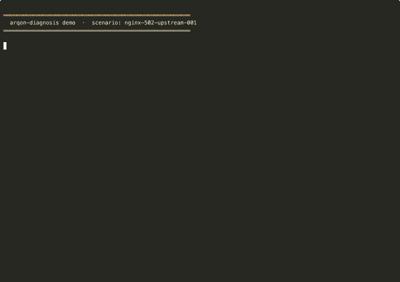
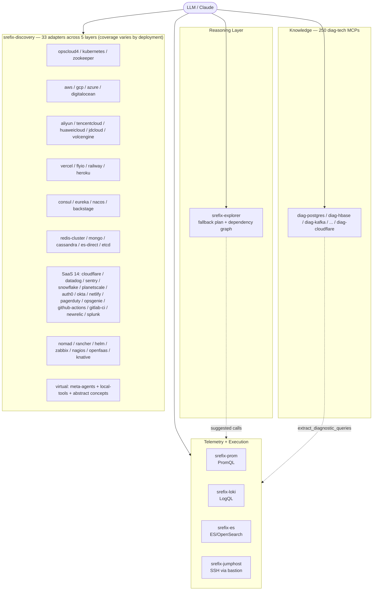
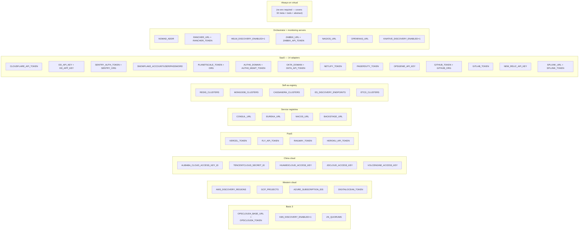

# srefix-diagnosis

Diagnosis-only knowledge stack delivered as MCP servers, plus telemetry / inventory MCPs that let an LLM run a full diagnose-with-evidence loop.



> **30-second demo**: Claude (headless) diagnoses an Nginx 502 incident by orchestrating
> 5 MCPs — `diag-nginx` (manual lookup), `srefix-explorer` (fallback plan),
> `srefix-mock-telemetry` (canned Prom/Loki/jumphost). Reasoning is real;
> only the telemetry I/O is mocked. Reproduce with `python3 demo/run_benchmark.py`.

> **Content provenance**: The diagnostic content under `agents/*.md` was
> SYNTHESIZED BY LARGE LANGUAGE MODELS (Claude family by Anthropic and/or
> GPT family by OpenAI), then validated against publicly-available open-source
> documentation. **No proprietary, internal, or non-public material was used.**
> See `NOTICE` for the list of public sources whose documentation informed
> synthesis, and `ISSUES.md` to report any copyright concerns.

## What's in this repo

| Directory | What it is |
|-----------|------------|
| `agents/` | 250 markdown diagnosis manuals |
| `mcp/` | One Python package with **250 entry-point launchers** — each is its own MCP server (`srefix-diag-postgres` / `srefix-diag-hbase` / ...) |
| `discovery-mcp/` | Auto-discovery MCP (33 adapters across 5 layers — cloud API / service registry / cluster bootstrap / k8s / VM tag). Coverage of any specific tech depends on its deployment shape; see "Coverage caveats" below. |
| `prometheus-mcp/` | PromQL query MCP |
| `loki-mcp/` | LogQL query MCP |
| `es-mcp/` | Elasticsearch / OpenSearch query MCP |
| `jumphost-mcp/` | SSH-via-jumphost executor with safety gating |
| `explorer-mcp/` | Tier-2/3 fallback exploration when manuals miss + cross-tech dependency fan-out |
| `verify-mcp/` | Metric-name verifier — diffs manuals against real-exporter whitelists. **Run this first.** See "Verify accuracy" below. |

## At a glance

**256 MCP servers, ~1799 tools, 33 discovery adapters across 5 layers.** Whether a given tech is *actually* auto-discoverable depends on how you deployed it — managed cloud service vs registered in Consul/ZK vs k8s workload vs tagged VM vs reachable bootstrap host. Techs that don't fit any path (local CLI tools / abstract concepts) are surfaced by a placeholder `virtual` adapter — listed, not "discovered." See "Coverage caveats" before relying on this.

### 5-scenario benchmark (real Claude, mocked telemetry)

Real Claude reasoning over 5 SRE incident scenarios. The mock-telemetry MCP
serves canned data per scenario so the demo is reproducible without a
production environment. Reasoning is genuine — only the I/O is mocked.

| Scenario | Difficulty | Pass | Duration | Keywords matched |
|----------|------------|------|----------|------------------|
| Nginx 502 Bad Gateway — Upstream Timeout | Basic | ✓ | 60.9s | 4/4 (100%) |
| MongoDB Replica Set Election Storm | Advanced | ✓ | 107.0s | 4/4 (100%) |
| etcd Disk I/O Latency Degrading Kubernetes | Advanced | ✓ | 104.3s | 5/5 (100%) |
| CoreDNS Failure — Cluster-wide DNS Outage | Advanced | ✓ | 97.4s | 4/4 (100%) |
| Cassandra GC Pause Storm | Intermediate | ✓ | 98.6s | 4/5 (80%) |

**Pass rate: 5/5 (100%) · avg 93.6s** — see [demo/](./demo/) to reproduce
locally with `python3 demo/run_benchmark.py`. Detailed JSON report:
[demo/benchmark_report.json](./demo/benchmark_report.json).

| Layer | MCP servers | Tools |
|-------|-------------|-------|
| Knowledge — 250 `diag-{tech}` | 250 | 1750 (7 each) |
| Telemetry — `srefix-prom` / `srefix-loki` / `srefix-es` | 3 | 22 |
| Execution — `srefix-jumphost` | 1 | 5–6 |
| Discovery — `srefix-discovery` (33 adapters) | 1 | 6 |
| Reasoning fallback — `srefix-explorer` | 1 | 8 |
| **Total** | **256** | **~1799** |

## Architecture



## Discovery layers + env-var matrix



**Each env block is independently opt-in.** Setting nothing leaves only the
virtual adapter active (which still surfaces the 32 meta/tools/abstract techs).

### Coverage caveats (read this before trusting "covered")

Discovery is **seeded, not scanned.** Whether a given tech in `agents/` is
actually surfaced by `srefix-discovery` depends on the deployment shape:

| If the tech is… | …it's discoverable via |
|----|----|
| A managed cloud service (RDS / ElastiCache / MSK / Aliyun RDS / Tencent Redis / etc.) | Layer 1 — cloud API |
| Self-deployed on tagged VMs (`Service=hbase`) | Layer 2 — VM tag classification |
| Registered in Consul / Nacos / Eureka / ZooKeeper | Layer 3 — service registry |
| Reachable from a bootstrap host (Redis / Mongo / Cassandra / ES / etcd) | Layer 4 — cluster bootstrap |
| Running as a k8s StatefulSet/Deployment | Layer 5 — kubeconfig walk |

**Things to know**:

- **Big-data stack (Spark / Hadoop / Hive / Trino)** maps to Layer 1 (only
  if you're on EMR / DataProc / HuaweiCloud MRS) **or** Layer 2 (tagged
  EC2 / GCE) **or** Layer 5 (k8s). Self-deployed Hive on bare metal that
  doesn't register anywhere → **not auto-discoverable** without contributing
  a custom seed.
- **Local CLI tools, abstract concepts, and meta-agents** (~32 techs:
  git / docker-compose / linux-perf / etc.) are surfaced by the `virtual`
  adapter, which **does no actual discovery** — it returns a placeholder
  cluster so the diag-{tech} MCP can still be invoked. Don't read these
  as "discovered."
- **ZooKeeper adapter** ships dispatchers for HBase / Kafka / Solr / HDFS HA
  (the last surfaces the active + standby NameNodes by parsing the
  `ActiveNodeInfo` protobuf in `/hadoop-ha/<nameservice>/ActiveStandbyElectorLock`;
  DataNodes are not in ZK — query the NN admin API to enumerate those).
- **Network adapters that can't be tested without a real cluster** (CN
  cloud SDKs, JD/Volcengine especially) are present but uncovered by the
  test suite — version drift in their SDKs may break them silently.
- The `vtgate_queries_error`-class problem (LLM hallucination in static
  content) doesn't apply here — discovery code is hand-written and uses
  real client libraries — but feature-completeness claims should be
  treated as "implemented" not "battle-tested in production."

### Self-deployed tech on raw cloud VMs (tag-based classification)

Cloud APIs only see "an EC2 instance" — they don't know the box is running
HBase. To bridge this, every cloud adapter accepts a tag-based classifier
that groups VMs into typed clusters matching `agents/<tech>.md`. Convention:

```
Service=hbase                  ← matches diag-hbase.md (tech short-name)
ClusterName=hbase-prod-us-east ← members with same value form one cluster
Role=master | regionserver     ← optional; surfaced as Host.role
```

Supported across **AWS / GCP / Azure / DigitalOcean / Aliyun / Tencent
Cloud / Huawei Cloud / JD Cloud / Volcengine** — each with the right
SDK-shape tag normalizer. The set of valid `Service` values is auto-loaded
from `agents/*.md`, so all 250 techs are recognized; adding a new manual
extends the matcher with no code change.

Example for AWS:

```python
from srefix_discovery_mcp.adapters.aws_extended import build_aws_ec2_classified

instances = ec2.describe_instances()['Reservations'][...]['Instances']  # raw boto3
clusters = build_aws_ec2_classified(instances, region='us-east-1', account='123')
# → 1 hbase cluster (3 nodes, roles preserved) + 1 kafka cluster + N untagged
```

Per-cloud entry points:

| Cloud | Function | Tag shape |
|-------|----------|-----------|
| AWS | `build_aws_ec2_classified` | `[{Key, Value}, ...]` |
| GCP | `build_gce_instances_classified` | `{key: value}` (lowercase) |
| Azure | `build_azure_vms_classified` | `{key: value}` |
| DigitalOcean | `build_do_droplets_classified` | `["service:hbase", ...]` |
| Aliyun | `build_aliyun_ecs_classified` | `{Tag: [{TagKey, TagValue}]}` |
| Tencent Cloud | `build_tc_cvm_classified` | `[{Key, Value}, ...]` |
| Huawei Cloud | `build_hw_ecs_classified` | `[{key, value}, ...]` |
| JD Cloud | `build_jd_vm_classified` | `[{Key, Value}, ...]` |
| Volcengine | `build_volc_ecs_classified` | `[{Key, Value}, ...]` |

Untagged instances fall through to per-cloud defaults (`ec2` / `gce` /
`azure-vm` / `droplet` / `cvm` / `vm`) so nothing is dropped silently.

For self-deployed HBase / Kafka on raw VMs, the **fastest path** is still
ZooKeeper (`ZK_QUORUMS=…`) — it works without any tagging. Tag-based
classification is the right answer when you want to discover **arbitrary**
self-deployed tech (Cassandra, ClickHouse, Redis, MongoDB, custom apps)
that doesn't necessarily register in ZK.

## Requirements

- **Python ≥ 3.10** (the `mcp` package requires it)
- macOS / Linux
- For `discovery-mcp[kubernetes]`: a kubeconfig
- For `discovery-mcp[zookeeper]`: network access to your ZK quorums
- For `jumphost-mcp`: working `~/.ssh/config` with `ProxyJump` entries + `ssh-agent` loaded

## Verify accuracy (recommended FIRST step)

The 250 manuals under `agents/` were LLM-synthesized. We audited 60 of them
manually (Phase 2 + 3, ~819 fixes — see `PHASE2_AUDIT.md` and
`PHASE3_AUDIT.md`); the remaining 190 are unverified and may still contain
hallucinated metric names, deprecated CLI flags, or version-drifted config
keys. **Before you install and trust this corpus, run the metric verifier.**

`verify-mcp` ships per-tech whitelists captured from real exporter
`/metrics` output and diffs them against every metric reference in the
manuals. Anything in a manual that doesn't exist in the real exporter is
flagged as a likely hallucination.

```bash
# 1. Install the verifier (small — no telemetry deps)
cd /Users/albericliu/PrivateWorkspace/GitHub/srefix-diagnosis/verify-mcp
pip install -e .

# 2. Run the audit on the whole agents/ corpus
srefix-verify-corpus /Users/albericliu/PrivateWorkspace/GitHub/srefix-diagnosis/agents

# Or just one tech
srefix-verify-corpus --tech vitess /Users/albericliu/PrivateWorkspace/GitHub/srefix-diagnosis/agents
```

Sample output:

```
Manuals scanned: 250
  with whitelist:      3  (nginx, prometheus, vitess)
  without whitelist: 247  (not yet covered)

In covered manuals: 58 metric references
  matched whitelist (likely real): 16
  flagged (likely hallucinated):   42

── Flagged metrics by manual ──
  [vitess]  19 flagged
    × vtgate_queries_error  ×6  L155,242,278,426,429,…
    × vtgate_queries_processed_total  ×4  L167,1252,1271,1326
    ...
```

`vtgate_queries_error` is a representative case: the LLM invented this
name and used it ~21 times in the Vitess manual; the real metric is
`vtgate_api_error_counts`. The verifier surfaces every such pattern with
file/line references so you (or a script) can patch them en masse.

### Adding a whitelist for a new tech

The current ship covers only **3 of 250 techs** — community contributions
are how we close the gap. To add a whitelist:

1. Boot the tech's exporter (locally or in CI), capture `/metrics`:
   ```bash
   curl http://<exporter>:<port>/metrics \
     | grep '^# HELP' | awk '{print $3}' | sort -u > metric_names.txt
   ```
2. Save as `verify-mcp/verify_mcp/whitelists/<tech>.json` with the format
   used by `vitess.json` (include `source`, `captured_at`, `method`).
3. Re-run `srefix-verify-corpus --tech <tech>` to see what gets flagged.
4. PR welcome.

For techs without a Prometheus exporter (CLI-only, Java JMX-only, etc.),
a CLI-flag verifier is on the roadmap — see `ISSUES.md`.

### Fixing what the verifier finds — propose / apply split

Once the verifier surfaces flagged metrics, the question is "what should they
be replaced with?" The `srefix-fix` tool keeps the LLM that *proposes* a fix
strictly separated from the deterministic tool that *applies* it — so an
LLM mistake can never silently reach `agents/`.

| Stage | Tool | Trust |
|-------|------|-------|
| Propose | `srefix-fix propose <tech>` — spawns `claude --print` with read-only `--allowedTools` (Read / Bash(grep) / WebFetch). Cross-checks the manual against the real exporter source and emits a YAML draft. | LOW (LLM may hallucinate) |
| Review | Human edits the YAML — drop unsure entries, correct `new` if proposer got it wrong, add `confirmed_by: <name>` to entries they trust | gate |
| Apply | `srefix-fix apply <yaml>` — pure regex `sed`, word-boundary safe, no LLM at runtime. Same input, same output, every CI run. | HIGH |

```bash
# 1. Auto-draft (read-only Claude run against the Vitess manual + source)
srefix-fix propose vitess
# → fix_maps/vitess.draft.yaml

# 2. Review (drop unsure entries, add confirmed_by)
$EDITOR fix_maps/vitess.draft.yaml
mv fix_maps/vitess.draft.yaml fix_maps/vitess.yaml
git add fix_maps/vitess.yaml

# 3. Dry-run, then real apply
srefix-fix apply fix_maps/vitess.yaml --dry-run
srefix-fix apply fix_maps/vitess.yaml

# 4. Inspect + commit
git diff agents/vitess-agent.md
git commit -am "fix(vitess): apply confirmed metric-name corrections"
```

See `fix_maps/README.md` for the full schema and `fix_maps/_example.yaml`
for a worked Vitess example (the `vtgate_queries_error → vtgate_api_error_counts`
headline fix).

**Why this design works for batch audits**:

1. `claude --print` headless lets the propose stage run unattended overnight
   across all 247 uncovered techs.
2. `--allowedTools` whitelist keeps Claude read-only — no possibility of
   it editing a manual directly.
3. YAML in git makes "LLM suggestion" and "human decision" separately
   reviewable and auditable.
4. The applier is pure `sed`. Run it 1000 times in CI; same diff every time.
5. `--dry-run` + `git diff` makes every actual change to `agents/` reviewable.

If you remember one thing: **proposer and applier MUST be separated, with a
human-reviewed YAML between them**. That separation is the only thing
guaranteeing "an LLM mistake doesn't pollute source-of-truth content."

### Use as an MCP tool

The verifier is also exposed as an MCP server (`srefix-verify`) so Claude
can self-check a manual before trusting it during diagnosis:

```json
{
  "mcpServers": {
    "srefix-verify": { "command": "srefix-verify" }
  }
}
```

Tools: `verify_manual`, `audit_corpus`, `list_whitelisted_techs`,
`whitelist_info`.

## Install

### 1. The 250 diagnosis MCPs (`mcp/`)

By default, `pip install -e .` would install all 250 commands. **You almost never want this** — too heavy for Claude. Pick a subset first.

```bash
cd /Users/albericliu/PrivateWorkspace/GitHub/srefix-diagnosis/mcp

# See what's available
python3 generate.py --list-all
python3 generate.py --list-all | grep -i sql

# Pick one of three filter modes:

# (a) explicit list
python3 generate.py --techs postgres redis kafka hbase k8s

# (b) from a file (recommended — you can git-commit the file)
cat > my_stack.txt <<'EOF'
postgres
redis
kafka
hbase
k8s
prometheus
nginx
istio
EOF
python3 generate.py --from-file my_stack.txt

# (c) regex
python3 generate.py --regex 'postgres|mysql|redis|kafka'

# Then install — only the selected commands appear on PATH
pip install -e .
```

Verify:

```bash
which srefix-diag-postgres   # should print a path
srefix-diag-postgres --help  # MCP servers don't have --help; if it starts and waits on stdio, it works
```

To **add** or **remove** a tech later: edit `my_stack.txt`, re-run `python3 generate.py --from-file my_stack.txt`, re-run `pip install -e .`.

To install all 250 anyway (not recommended in Claude config, OK on PATH):
```bash
python3 generate.py     # no filter = all 250
pip install -e .
```

### 2. Discovery MCP (cluster auto-discovery)

```bash
cd /Users/albericliu/PrivateWorkspace/GitHub/srefix-diagnosis/discovery-mcp
pip install -e ".[all]"   # includes kubernetes + kazoo extras
# Or pick one:
#   pip install -e ".[kubernetes]"
#   pip install -e ".[zookeeper]"
#   pip install -e .             # opscloud4-only
```

Adapters auto-register based on env vars:

```bash
# opscloud4 (any one of: REST CMDB)
export OPSCLOUD4_BASE_URL=https://opscloud.your-corp.com
export OPSCLOUD4_TOKEN=<x-token>

# kubernetes (uses ambient kubeconfig)
export K8S_DISCOVERY_ENABLED=1
export K8S_CONTEXTS=prod-east,prod-west       # optional

# zookeeper (HBase / Kafka legacy / Solr)
export ZK_QUORUMS="zk-prod-east=zk1:2181,zk2:2181,zk3:2181;zk-prod-west=zkw1:2181"
export ZK_WATCHES=hbase,kafka,solr            # optional, default = all

export DISCOVERY_CACHE_TTL=300                # optional, default 300s
```

Run: `srefix-discovery`

### 3. Prometheus MCP

```bash
cd /Users/albericliu/PrivateWorkspace/GitHub/srefix-diagnosis/prometheus-mcp
pip install -e .

export PROMETHEUS_URL=http://prometheus.prod:9090
# Optional auth:
#   PROMETHEUS_TOKEN=<bearer>
#   PROMETHEUS_USERNAME=... PROMETHEUS_PASSWORD=...
#   PROMETHEUS_VERIFY_TLS=0   (skip TLS verify)
#   PROMETHEUS_TIMEOUT=30
```

Run: `srefix-prom`

### 4. Loki MCP

```bash
cd /Users/albericliu/PrivateWorkspace/GitHub/srefix-diagnosis/loki-mcp
pip install -e .

export LOKI_URL=http://loki.prod:3100
# Optional:
#   LOKI_TOKEN=<bearer>           or LOKI_USERNAME / LOKI_PASSWORD
#   LOKI_ORG_ID=<tenant>          (multi-tenant Loki)
#   LOKI_TIMEOUT=30
#   LOKI_VERIFY_TLS=0
```

Run: `srefix-loki`

### 5. Elasticsearch / OpenSearch MCP

```bash
cd /Users/albericliu/PrivateWorkspace/GitHub/srefix-diagnosis/es-mcp
pip install -e .

export ES_URL=https://es.prod:9200
# Auth (one of):
#   ES_API_KEY=<id:secret base64>
#   ES_USERNAME=... ES_PASSWORD=...
# Optional:
#   ES_VERIFY_TLS=0
#   ES_TIMEOUT=30
```

Run: `srefix-es`

### 6. Jumphost MCP (SSH via bastion)

```bash
cd /Users/albericliu/PrivateWorkspace/GitHub/srefix-diagnosis/jumphost-mcp
pip install -e .
```

Set up two YAML config files:

```bash
mkdir -p ~/.config/srefix

# Inventory — which hosts exist + their tags
cat > ~/.config/srefix/inventory.yaml <<'EOF'
hosts:
  pg-prod-1:
    tags: {env: prod, tech: postgres, role: primary}
  pg-prod-2:
    tags: {env: prod, tech: postgres, role: replica}
  hbase-rs-001:
    tags: {env: prod, tech: hbase, role: regionserver}
EOF

# Presets — read-only commands the LLM is allowed to invoke
cat > ~/.config/srefix/presets.yaml <<'EOF'
postgres:
  pg-replication-status:
    description: Replication status from primary
    command: 'psql -At -c "SELECT pid, state, sent_lsn FROM pg_stat_replication"'
    allowed_roles: [primary]
    timeout: 10
  pg-table-size:
    description: Size of one table
    command: 'psql -At -c "SELECT pg_total_relation_size(''{table_name}'')"'
    allowed_roles: [primary, replica]
    allowed_args: [table_name]
    timeout: 10
EOF
```

Make sure `~/.ssh/config` has `ProxyJump` set up for each host:

```ssh-config
Host bastion
  HostName bastion.your-corp.com
  User you

Host pg-prod-*
  ProxyJump bastion
  User postgres
```

Env:

```bash
export JUMPHOST_INVENTORY=~/.config/srefix/inventory.yaml
export JUMPHOST_PRESETS=~/.config/srefix/presets.yaml
export JUMPHOST_MODE=preset_only       # default; safest
# Other modes:
#   JUMPHOST_MODE=filtered_arbitrary    # `run` enabled, denylist applied
#   JUMPHOST_MODE=unrestricted          # `run` enabled, no filter (use with external approval)
export JUMPHOST_DRY_RUN=1              # never actually exec; great for testing
export JUMPHOST_DEFAULT_TIMEOUT=30
```

Run: `srefix-jumphost`

### 7. Explorer MCP (Tier-2/3 fallback)

```bash
cd /Users/albericliu/PrivateWorkspace/GitHub/srefix-diagnosis/explorer-mcp
pip install -e .
```

No env required. 8 tools:
- `fallback_exploration_plan(symptom, tech?, cluster_id?, host_pattern?)` — Tier-2 structured plan
- `free_explore_bootstrap(symptom, tech?, cluster_id?)` — Tier-3 schema-aware starter
- `expand_to_dependencies(tech, depth?, observation?)` — upstream fan-out via dep graph
- `expand_to_dependents(tech)` — blast-radius reverse lookup
- `reflect_on_findings(findings, top_k?)` — feed evidence back, get keywords
- `categorize_symptom` / `list_symptom_categories` / `list_supported_techs`

Run: `srefix-explorer`

## Register with Claude

Add to your Claude MCP config:

- Claude Desktop: `~/Library/Application Support/Claude/claude_desktop_config.json`
- Claude Code: `~/.config/claude-code/mcp.json` or project-level `.claude/mcp.json`

Skeleton (pick the MCPs you actually want):

```json
{
  "mcpServers": {
    "discovery": {
      "command": "srefix-discovery",
      "env": {
        "OPSCLOUD4_BASE_URL": "https://opscloud.your-corp.com",
        "OPSCLOUD4_TOKEN":    "...",
        "K8S_DISCOVERY_ENABLED": "1",
        "ZK_QUORUMS": "zk-prod-east=zk1:2181,zk2:2181,zk3:2181"
      }
    },
    "prom":     { "command": "srefix-prom",  "env": { "PROMETHEUS_URL": "..." } },
    "loki":     { "command": "srefix-loki",  "env": { "LOKI_URL": "..." } },
    "es":       { "command": "srefix-es",    "env": { "ES_URL": "...", "ES_API_KEY": "..." } },
    "jumphost": {
      "command": "srefix-jumphost",
      "env": {
        "JUMPHOST_INVENTORY": "/Users/you/.config/srefix/inventory.yaml",
        "JUMPHOST_PRESETS":   "/Users/you/.config/srefix/presets.yaml",
        "JUMPHOST_MODE":      "preset_only",
        "JUMPHOST_DRY_RUN":   "1"
      }
    },
    "diag-postgres": { "command": "srefix-diag-postgres" },
    "diag-hbase":    { "command": "srefix-diag-hbase" },
    "diag-redis":    { "command": "srefix-diag-redis" },
    "diag-kafka":    { "command": "srefix-diag-kafka" },
    "diag-k8s":      { "command": "srefix-diag-k8s" }
  }
}
```

For the diag-* block, generated automatically — copy whichever lines you need from `mcp/claude_mcp_config.json`. Or filter to a subset:

```bash
cd mcp
python3 filter_config.py postgres redis kafka hbase k8s > ~/my_diag_subset.json
# then merge ~/my_diag_subset.json["mcpServers"] into your Claude config
```

## How the diagnose-with-evidence loop works

```
Observation: "PostgreSQL replica 复制延迟 > 5min"
  │
  ├─ discovery.list_hosts(tech="postgres", role="primary")
  │       → ["pg-prod-1"]
  ├─ diag-postgres.diagnose("replication lag spiking")
  │       → case "ReplicationLagCritical" + Symptoms / Diagnosis / Root Cause Tree / Thresholds
  ├─ diag-postgres.extract_diagnostic_queries("ReplicationLagCritical")
  │       → [4 structured queries: 3 psql + 1 shell, each with suggested_mcp]
  │
  ├─ prom.range_query("pg_replication_lag_seconds{...}", "-30m", "now")
  ├─ jumphost.run_safe(host="pg-prod-1", tech="postgres",
  │                    preset_name="pg-replication-status")
  ├─ loki.query_range('{app="postgres"} |= "wal"', "-30m", "now")
  ├─ es.search("logs-postgres-*", query='level:ERROR AND host:"pg-prod-1"')
  │
  └─ Claude correlates evidence + manual → diagnosis + suggested fixes
```

## Verify install

```bash
# Each command should be on PATH:
which srefix-discovery srefix-prom srefix-loki srefix-es srefix-jumphost
which srefix-diag-postgres   # plus whichever diag-* you generated

# Smoke-test one MCP server (will hang on stdin — that's normal; Ctrl-C to exit):
srefix-diag-postgres

# Full inspection via the MCP CLI inspector:
npx @modelcontextprotocol/inspector srefix-diag-postgres
```

## Troubleshooting

| Symptom | Cause / Fix |
|---------|-------------|
| `ModuleNotFoundError: No module named 'mcp'` | Python < 3.10 or `pip install` ran with the wrong interpreter. Use `python3.10 -m pip install -e .` |
| `srefix-diag-foo: command not found` | `foo.md` exists but you didn't include `foo` in the `generate.py` filter. Re-run `generate.py` + `pip install -e .` |
| Discovery returns 0 clusters | Missing env vars (no adapter enabled), or auth failure — check `discovery_health()` output |
| `jumphost.run_safe` returns "host not in inventory" | Add the host to your `inventory.yaml`, or your `JUMPHOST_INVENTORY` env points at a different file |
| Claude can't see the MCP | Restart Claude after editing config; Claude only re-reads at startup |

## License

**Apache License 2.0** — see `LICENSE` for the full text and the
"CONTENT PROVENANCE DISCLOSURE" section explaining how the diagnostic
content was synthesized.

Apache 2.0 was chosen over MIT because it adds an explicit patent grant,
which protects users (and contributors) against patent claims by adopters.
See `NOTICE` for required attribution and `ISSUES.md` for the copyright
takedown procedure.
